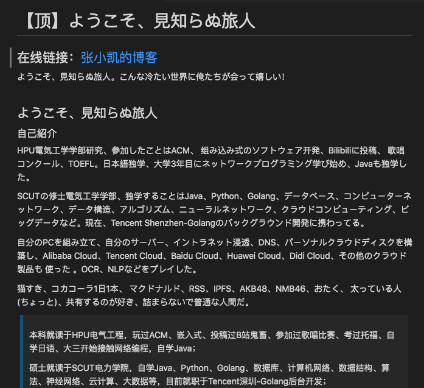

前文《[基于 git 的去中心化内容收发平台](https://zhuanlan.zhihu.com/p/346258393)》原则上适用于各种格式的内容，但综合考虑下，打算从以 markdown 格式在 git 平台上公开发布的博客入手。

下面演示博客读者会如何使用该工具，内容借用 [这几天搜集的部分博客](https://gitee.com/zhishi/collection-of-chinese-blogs)。暂无界面设计。

## 功能分析

### 1. 工具启动

内置博客的在线地址以及内容所在 git 仓储（各博主可以申请将自己博客添加到此列表），以如下为例：

| 博客网址 | git 仓储 | 格式 | 相关
| ------------- | ------------- | ------------- | ------------- |
| [近视眼逛博客](https://ditou.org/) | [github](https://github.com/1078503/blog) | md hugo | 随笔; 技术
| [林一二的开放记忆 \| 关于前端_模因学_语义网_游戏开发_的博客](https://onetwo.ren/) | [github](https://github.com/linonetwo/linonetwo.github.io) | md Jekyll | 开发
| [JalenChuh 的个人博客](https://blog.jalenchuh.cn/) | [github](https://github.com/jalenchuh/blog) | md Gridsome | 开发
| [Vivaxy's blog](https://vivaxyblog.github.io) | [github](https://github.com/vivaxyblog/vivaxyblog.github.io) | md Jekyll | 编程
| [Qt进阶之路-涛哥的博客](https://jaredtao.gitee.io/) | [gitee](https://gitee.com/jaredtao/jaredtao/tree/tao/) | md hexo | 编程; Qt
| [Claude's Blog](https://claude-ray.github.io) | [github](https://github.com/claude-ray/claude-ray.github.io) | md Hexo| 编程; 折腾
| [桑弧蓬矢射四方](https://iphyer.github.io/) | [github](https://github.com/iphyer/iphyer.github.io) | md Jekyll | 深度学习; 科研; 生活
| [Mayx的博客](https://mabbs.github.io/) | [github](https://github.com/mabbs/mabbs.github.io) | md Jekyll | 编程; 随笔; 生活
| [the wandering potato 出遊的土豆](https://thewanderingpotato.github.io/) | [github](https://github.com/thewanderingpotato/thewanderingpotato.github.io) | md Jekyll | 随笔; 生活; 摄影
| [news view](https://zsqk.github.io/news/) | [github](https://github.com/zsqk/news) | md Jekyll | 编程; 随笔
| [Luyu Huang's Tech Blog](https://luyuhuang.tech/) | [github](https://github.com/luyuhuang/luyuhuang.github.io) | md Jekyll | 编程
| [张小凯的博客](https://jasonkayzk.github.io/) | [github](https://github.com/jasonkayzk/jasonkayzk.github.io) | md hexo | 编程; 后端; 生活; 分享
| [前端技术漫游指南](http://qingbob.com/) | [github](https://github.com/hh54188/jekyll-blog) | md Jekyll
| [Bingwhispers](https://cyril3.github.io) | [github](https://github.com/cyril3/cyril3.github.io) | md Jekyll | 编程; 生活
| [Joe's Blog](https://hijiangtao.github.io/) | [github](https://github.com/hijiangtao/hijiangtao.github.io) | md Jekyll

初次运行时，git clone 将各内容下载到本地，后可定时从 git 平台同步最新内容。

下面操作如无特别说明都在本地进行，不依赖任何在线服务。

### 2. 概览

可以概览各发布者，包含基本数据，比如博客名称、最近更新时间、博文篇数、高频词、本地数据所占空间等等

点击进入内容列表，可见各 md 文件基本信息（取材自 [JalenChuh 的个人博客](https://blog.jalenchuh.cn/)）：
| 日期 | 题目 |
| ------------- | ------------- |
| 2021-01-02 | 再见 2020，你好 2021
| 2020-10-02 | 「月记」你好高二
| 2020-07-05 | 利用 GitHub Action 实现自动化
| ……

### 3. 搜索

根据关键词搜索（效果借用 vscode 搜索）

点击对应博文，可见图片等（取材自 [Vivaxy's blog](https://vivaxyblog.github.io/2017/07/12/webpack-require-context.html)）：

附有该博文的在线地址（取材自 [张小凯的博客](https://jasonkayzk.github.io/2020/09/12/%E3%80%90%E9%A1%B6%E3%80%91%E3%82%88%E3%81%86%E3%81%93%E3%81%9D%E3%80%81%E8%A6%8B%E7%9F%A5%E3%82%89%E3%81%AC%E6%97%85%E4%BA%BA/)）以便访问：

### 4. 评论
无需任何注册服务，可对任一博文（甚至针对其中某一片段）添加评论、回复其他评论。评论也是一种生产出的内容，性质与博文相同，同样可以使用 markdown 格式编写。

评论内容默认用新的本地 git 仓库保存，如自己博客已在列表中，可以保存在同一仓库。如果想公布自己的评论，只需将评论内容 push 到 git 平台。若是新仓库，则将仓库地址提交到工具内置列表（此列表和客户端工具都通过开源维护），不必以静态网页的形式部署。本工具的所有用户都将在获取该仓储内容到本地后，在被评论的博文下看到评论内容。

### 5. 内容管理

与原创内容类似，发评论者可搜索、查看所有自己发布过的评论，也可以删除、修改。

### 6. 关注与更新通知

用户可以设置关注某位内容发布者，当发布内容更新时可获得通知。

关注信息可存在本地也可作为内容发布。

### 7. 推荐机制

可根据搜索和浏览历史、评论内容、以及各种本机信息（比如手头正在开发的项目）进行推荐。不必将这些信息上传至任何在线服务，完全倚靠工具内置推荐功能。可用于在搜索排序、工具首页内容、实时通知等等。
