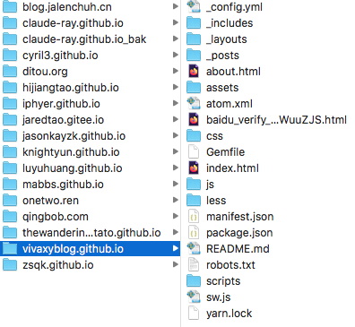
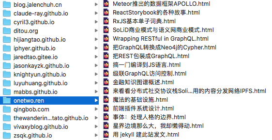
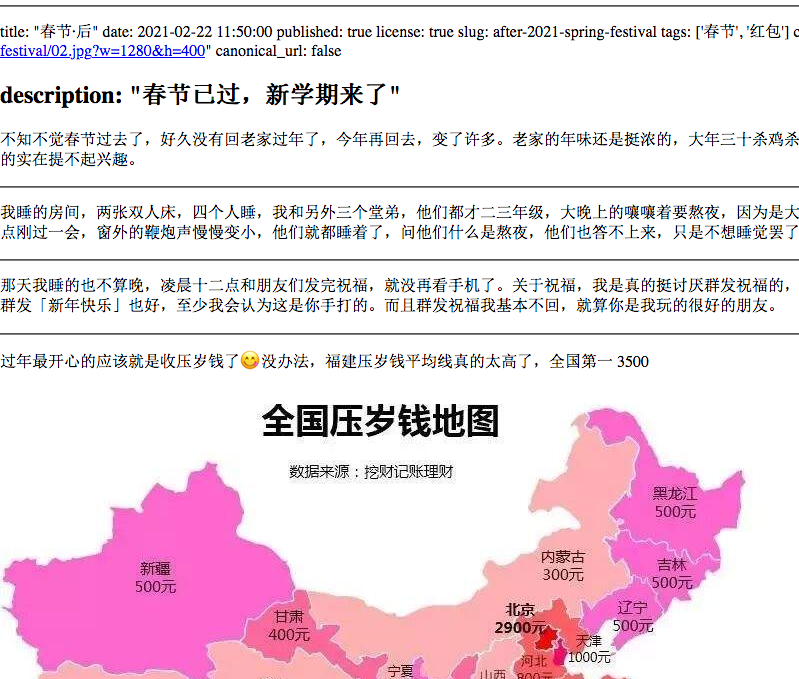
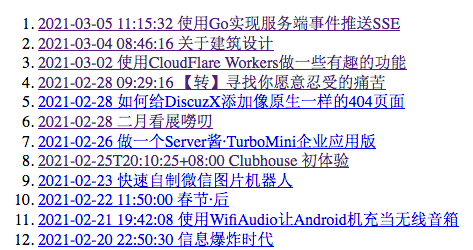
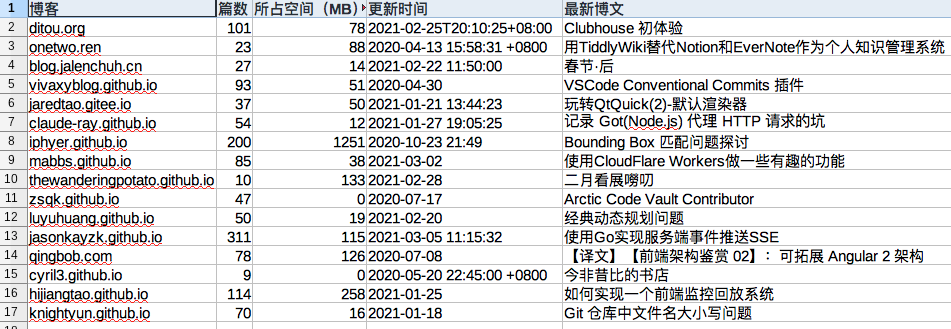

之前 [设想功能之后](https://gitee.com/zhishi/collection-of-chinese-blogs/blob/master/%E6%96%87%E6%A1%A3/2021-01-26-%E5%9F%BA%E4%BA%8E%20git%20%E7%9A%84%E5%8D%9A%E5%AE%A2%E8%81%9A%E5%90%88%E5%B7%A5%E5%85%B7%E4%BD%BF%E7%94%A8%E5%9C%BA%E6%99%AF%EF%BC%88%E4%B8%80%EF%BC%89%EF%BC%9A%E8%AF%BB%E8%80%85.md)，这两个礼拜逐渐完成了最基本的一些功能。代码开源 [在此](https://gitee.com/zhishi/collection-of-chinese-blogs/tree/master/%E5%8E%9F%E5%9E%8B)，照例使用中文命名标识符。

### 基本功能

- 将十六个 markdown 格式的博客内容从 git 仓库批量同步到本地

- 从 md 格式博文生成 html 网页于本地，一千三百篇约耗时半分钟：

远程图片可以显示：

- 生成一个目录页，最新博文排列最前，点击链接即打开本地对应博文网页

- 对各博客内容作初步统计，包括博文篇数、本地所占空间（共 2.3G）、更新时间、最新博文

### 待做事项

- 添加评论功能
  - 支持嵌入针对文中某段的评论，类似于 word 文档的批注
- 仓库同步
  - 输出格式化，比如哪个博客新加几篇博文等。
  - 支持指定仓库分支，如 [qingbob.com](https://github.com/hh54188/jekyll-blog) 使用 gh-pages 分支
- 网页生成
  - 内容改进，比如头部信息过杂
  - 显示本地图片。现在仅显示远程图片。
- 搜索与推荐
  - 按关键词、分类
  - 按特征, 如是否带图片、更新时间范围等
  - 索引排序，根据预设兴趣、浏览历史等等
- 充分利用 md 文件头部信息
  - 分类、关键词等
  - cover 图片显示
